# SIMULAÇÃO DISCRETA

## SIMULADOR FILA SIMPLES - LAVACAR

Documentação
Software criado por: Danilo de Maria e Vinicius da Palma Martins
Esta é a documentação do software criado para a matéria de Simulação Discreta, desenvolvido por Danilo de Maria e Vinicius da Palma Martins. O software foi desenvolvido para apresentar os dados de um “Lavacar”. Algumas informações são importantes para testar corretamente todas as funcionalidades implementadas. Abaixo segue etapas com instruções e imagens do procedimento a ser realizado e também algumas informações dos arquivos gerados pelo software. Todas as validações foram implementadas e testadas, o software permite o usuário escolher apenas uma opção para cada parâmetro, sem exceções.

Abaixo segue uma figura completa da aplicação de usuário

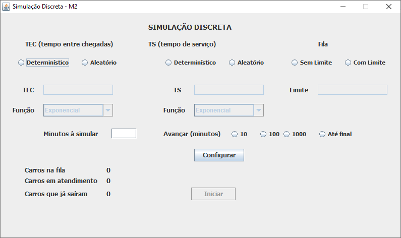 

Informação 01: Na pasta raiz do projeto, após o primeiro teste, irá conter três arquivos no formato .txt.  O primeiro arquivo chamado “TEC.txt”, é gerado conforme a escolha do usuário, também é importante ressaltar que caso a pessoa que está realizando teste precise verificar os números que foram gerados estão corretos, será necessário abrir esse arquivo com um editor de texto mais robusto como sublime ou VSCode, pois o bloco de notas do Windows apresenta caracteres aleatórios. Esse arquivo “TEC.txt” irá conter os dados gerados pelo primeiro parâmetro definido pelo usuário, que é o Tempo entre Chegadas. Esse tempo pode ser determinístico, na qual a soma das probabilidades irá resultar em um valor inteiro, normalmente 1. Caso o usuário escolha um tempo entre chegadas aleatórios, poderá ser exponencial, uniforme, normal ou triangular. Abaixo segue 3 figuras, a primeira ilustra qual forma o usuário irá definir estes parâmetros, a segunda mostra o arquivo gerado de forma determinística, e por fim o arquivo gerado por uma função aleatório exponencial.
Interface gráfica da definição do parâmetro TEC 
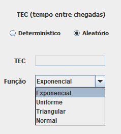 
Arquivo gerado determinístico
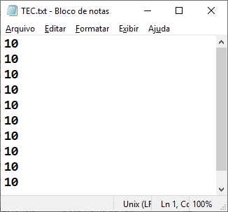 
Arquivo gerado com função aleatória exponencial
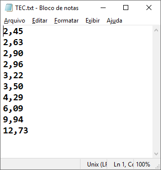 

Informação 02: Nesta etapa, o usuário irá definir o tempo de serviço do funcionário que está lavando os carros. Foi utilizado em todas as etapas a sigla TS para tempo de serviço, assim como a geração do arquivo (TS.txt) com os dados gerados tanto pelas funções aleatórias, como a determinística. Como a geração de arquivos é exatamente a mesma que a da função anterior, abaixo segue uma previa como o usuário irá definir este parâmetro. 
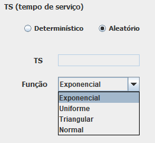 
 
Informação 03: Outro parâmetro importante que é definido para a simulação, é a restrição da fila. Neste software, o usuário pode definir dois tipos de fila. O primeiro sem limite, onde não importa quantos carros estejam esperando para lavar, de acordo com a função definida anteriormente, o carro que chega sempre irá esperar para ser atendido, mesmo sem saber se irá ter tempo para ser lavado ou não. O segundo caso, o usuário pode definir um limite para a fila de espera da lavação, que neste caso, com a chegada de um carro, é feita a validação para decidir se o mesmo entra na fila, ou se vai embora. O campo para ser inserido o parâmetro de limite de fila só é liberado quando o usuário seleciona a opção com fila. Segue abaixo uma figura que apresenta a interface gráfica para o usuário.
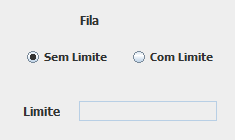  

Informação 04: Na definição de tempo, o usuário deverá informar em minutos, quanto tempo o software deve simular o sistema da lavação de carros. Independentemente do valor inserido pelo usuário, a aplicação terá funções que permitirão parar em determinados pontos da simulação, que serão vistos posteriormente. Segue abaixo figura de como o usuário irá inserir o tempo de simulação.
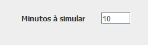 

Informação 05: Este é o ponto final da configuração do usuário, onde o mesmo pode configurar o tempo de avanço da simulação. Definimos por padrão 4 avanços diferentes. O primeiro a cada 10 minutos de simulação, aguarda a confirmação do usuário para continuar. O segundo avança 100 minutos. O terceiro avança 1000 minutos. E por fim, a aplicação avança até o final sem parar, apenas para mostrar o resultado da simulação. Por não ter sido implementado a animação na aplicação, foi definido apenas alguns rótulos para informar o usuário entre as pausas três informações que foram cotadas como mais importantes: Carros na fila, Carro em atendimento, Carros que já saíram. A figura abaixo mostra esta configuração de avanço no tempo e informações em tempo real do lava car.
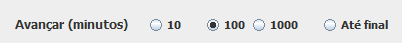  

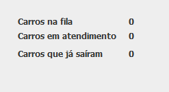 

Informação 06: Agora após verificar se todos os parâmetros estão de acordo com o desejado o usuário irá clicar no botão de configura, onde o software irá realizar procedimentos internos para continuar a simulação. Caso exista alguma divergência, o usuário será informado através de uma janela de diálogo se existe algum parâmetro faltando. A validação vai ocorrer em todos os campos, ou seja, o programa só irá continuar quanto todos os parâmetros forem definidos.
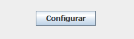 
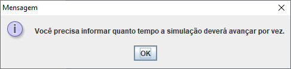 
 
Informação 07: Por fim, se todos os parâmetros foram definidos corretamente, o software irá gerar um arquivo txt que estará também salvo na pasta raiz do projeto como Resultados.txt. Ele é responsável para exibir o relatório final para o usuário, onde alguns dados importantes são apresentados. O arquivo será aberto para o usuário e é mostrado na figura abaixo.
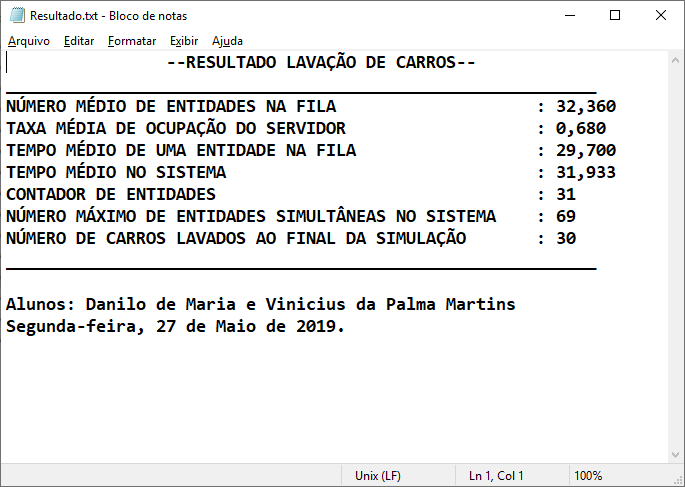 
